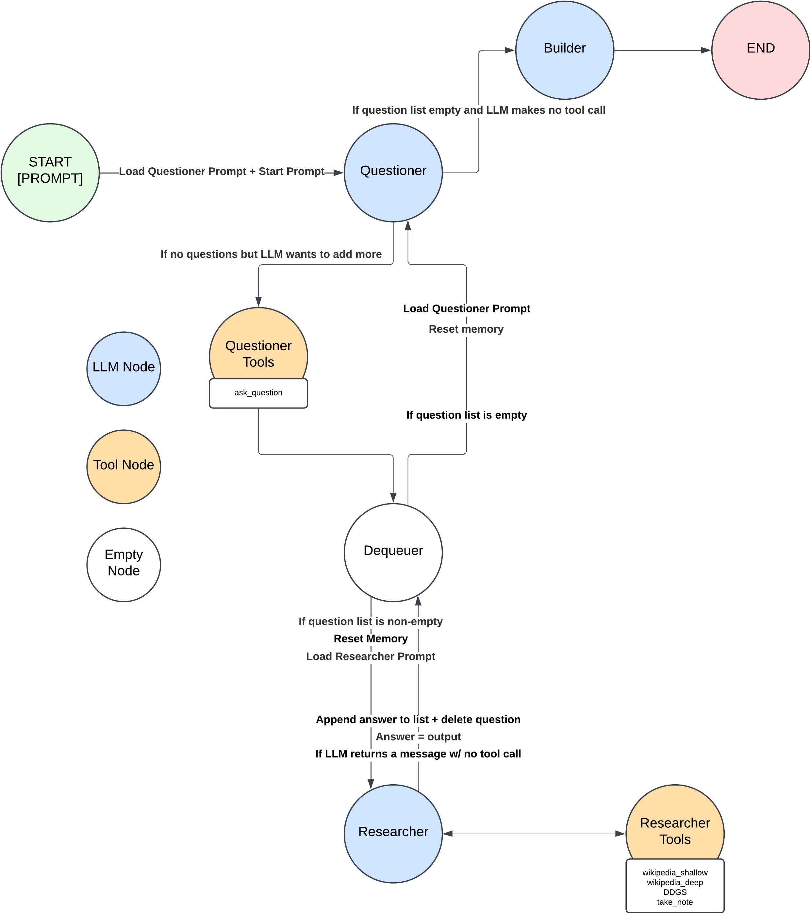

# llm_timeliner_course_proj
How to get started:
1. clone git
2. create a venv
3. pip install -r requirements.txt
4. create .streamlit/secrets.toml
5. add OPENAI_API_KEY="<YOUR KEY HERE>"
6. add BLACKLIST_SEARCH_TERMS=["<PRIVATE INFO>"] (this is used to blacklist the LLM from searching these keywords online, you can put private information here to prevent accidental leakage)
7. streamlit run src/main.py
8. [go to localhost:8001](http://localhost:8501)
9. input a search query

Note:
- try to specify a time window
- recent news are more volatile and will be difficult for the LLM
- you can swap out gpt-4o-mini with gpt-4o in Assistant.py for better performance
- when creating a new ModelGraph, you can pass hyperparameters max_questions=5 (stop researching if we hit 5 questions answered), max_notes=5 (stop researching if we hit 5 notes logged), recursion_depth=100 ([langgraph recursion depth](https://langchain-ai.github.io/langgraph/how-tos/recursion-limit/))

# Timeliner: An LLM Timeline Generator with Statefulness and Self Reflection

## Problem Context
State of the art LLM models today require massive compute for training and operation. Once a model is trained, it can be used, however, it cannot learn new facts about the internet after it has been trained. This point in time is often referred to as the cutoff point. The current LLM strategies employed by companies such as OpenAI and Anthropic are to gather data and retrain their models on the new data occasionally with some tool usage.

Because AIs have this cutoff point in their training data, they cannot access new information. If a user were to ask an AI model about the recent news on Bitcoin mining or recent interesting research papers, they would receive an "I don't know" response from the LLM.

Currently, some tools exist to provide the LLM web search access, however, these models often focus on solving a singular question (example, "what is the height of the Eiffel tower?") instead of solving more open-ended questions (example, "should I go swimming at Cocoa beach today?" which would require planning to search weather, public advisory, ratings of beach, etc).

A useful task, often time consuming and manual, is scouting research. To keep up to date on the latest information, manual searching and reading is required (if one is lucky, maybe a good emailer's digest). For any question, it would be useful to have an LLM generate a good summary and visualization of the information. For this problem, this project's scope is to produce a timeline to help with understanding a new topic.

## Project Objectives
This project aims to create a framework for an off-the-shelf LLM to search a database (given tools to do so), pick out relevant information, and store it in a timeline format. The model must also direct itself to its own research by asking questions.

1. For an LLM to perform the ReAct-like architecture (acting, observing, repeating)
2. For an LLM to observe the results and ask questions if necessary and perform the actions in parallel
3. For an LLM to "take notes" (capture the source to the information, summarize it, store it for later recall)
4. To create a system that reads the notes and creates a displayable data format in the form of a timeline

## Methodology

## Approach
Given a user prompt to the LLM with a pre-written system prompt, allow the LLM to explore certain parts of the web on its own.

Two layers will be implemented called `questions` and `notes`. Also to save token usage, the model will be queried a new prompt each time (this achieves statefulness). This prompt will include its notes, active questions, answered questions, the user's prompt, list of actions, and other important metadata (like today's date & time).

### Algorithm:
1. Receive user input
2. Generate questions
   - Append questions to a list
3. Answer questions one by one by doing online research
   - Dequeue a question
   - Research to answering that question (will sometimes append notes about a result)
   - Produce an answer
   - Append the question + answer to a "QNA list"
   - Repeat until questions list is empty
4. Return to 2, if no more questions are needed or # answers > N, move to 5
5. Build timeline by referencing notes and questions

## Technologies Used
### LLMs:
- GPT-4o latest version
- GPT-4o-mini latest version

### Techniques:
- LangChain: used for wrappers and helpers for interacting with the LLM
- ReAct & Tools: ReAct-like prompting plus additional custom coded tools the LLM can use
- Prompt Engineering: ReAct and structured output prompting strategies
- duckduckgo-search: for querying DuckDuckGo
- Wikipedia API: for searching wikipedia
- Arxiv: used for searching academia papers

## Results
For detailed results and analysis, please refer to the full paper.

## Future Work
- RAG/Similarity: Implementation of RAG vector similarity/ROUGE score for duplicate detection
- Clickable References: Adding links between notes/answers and their sources
- Parallel Processing: Optimization of research question processing
- Additional search engines experimentation

## Deliverables
- [Code Repository](https://github.com/nhat-nguyen-tamu/llm_timeliner_course_proj)
- [Demo Video](https://youtu.be/k_ohLbB1x0U)
